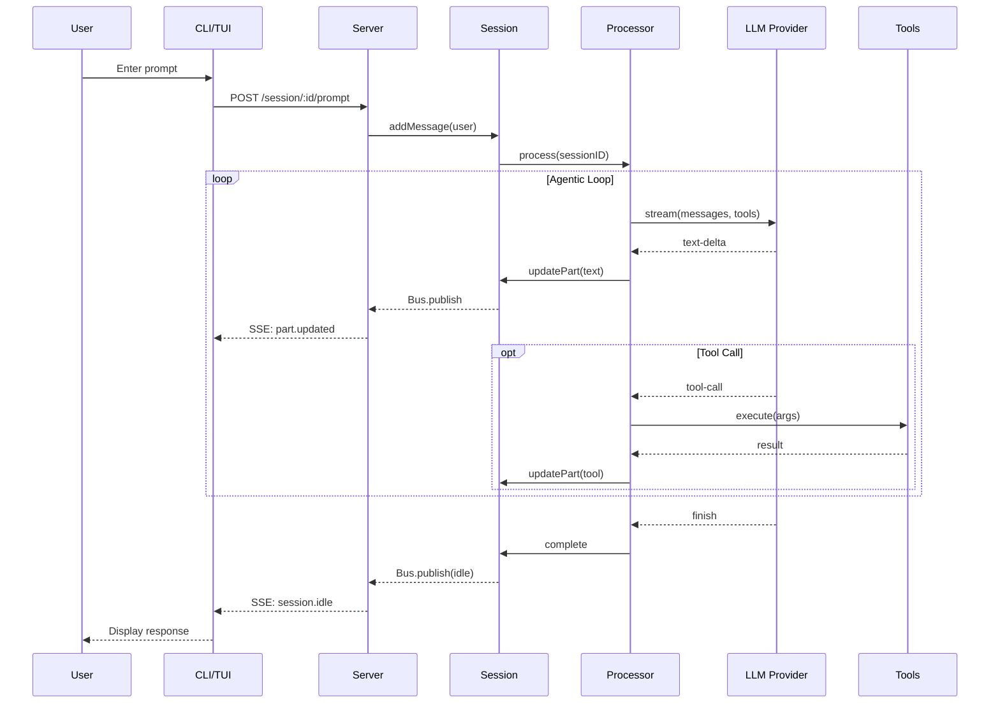

# Architecture Overview

## What is OpenCode

OpenCode is an AI-powered CLI development tool that provides an agentic coding assistant. It supports multiple LLM providers, extensible tools, and runs as both a CLI and a local HTTP server.

## Technology Stack

| Layer | Technology |
|-------|------------|
| Runtime | Bun |
| Build | Turbo (monorepo) |
| CLI Framework | Yargs |
| HTTP Server | Hono |
| LLM Integration | Vercel AI SDK |
| TUI | SolidJS + OpenTUI |
| Storage | File-based JSON |

## Repository Structure

```
packages/
├── opencode/          # Core CLI + server (main package)
│   └── src/
│       ├── cli/       # CLI commands and UI
│       ├── agent/     # Agent definitions and prompts
│       ├── session/   # Session management, processor, LLM
│       ├── tool/      # Built-in tools (bash, edit, read, etc.)
│       ├── provider/  # Multi-provider LLM abstraction
│       ├── config/    # Layered configuration system
│       ├── server/    # Hono HTTP API
│       ├── mcp/       # Model Context Protocol integration
│       ├── permission/# Tool permission system
│       └── storage/   # File-based persistence
├── app/               # SolidJS TUI application
├── sdk/               # Client SDK (JS)
├── plugin/            # Plugin system types
├── ui/                # Shared UI components
├── desktop/           # Tauri desktop wrapper
└── web/               # Web interface
```

## Core Components

```
┌─────────────────────────────────────────────────────────────────────────┐
│                              CLI Layer                                   │
│  index.ts → yargs → commands (run, auth, mcp, agent, serve, etc.)       │
└─────────────────────────────────┬───────────────────────────────────────┘
                                  │
┌─────────────────────────────────▼───────────────────────────────────────┐
│                           Bootstrap Layer                                │
│  Instance.provide() → Config → Storage → Provider → MCP                  │
└─────────────────────────────────┬───────────────────────────────────────┘
                                  │
┌─────────────────────────────────▼───────────────────────────────────────┐
│                           Server Layer                                   │
│  Hono routes: /session, /provider, /config, /mcp, /event (SSE)          │
└─────────────────────────────────┬───────────────────────────────────────┘
                                  │
┌─────────────────────────────────▼───────────────────────────────────────┐
│                          Session Layer                                   │
│  Session CRUD │ MessageV2 │ Prompt Assembly │ Usage Tracking             │
└─────────────────────────────────┬───────────────────────────────────────┘
                                  │
┌─────────────────────────────────▼───────────────────────────────────────┐
│                         Processor (Agent Loop)                           │
│  LLM.stream() → tool-call → Permission.check() → Tool.execute() → loop  │
└──────────────┬──────────────────────────────────┬───────────────────────┘
               │                                  │
┌──────────────▼──────────────┐    ┌──────────────▼──────────────────────┐
│       Provider Layer        │    │           Tool Layer                │
│  Anthropic, OpenAI, Bedrock │    │  bash, edit, read, grep, task, etc. │
│  Google, Copilot, Custom    │    │  + MCP tools + Plugin tools         │
└─────────────────────────────┘    └─────────────────────────────────────┘
```

### Component Diagram (Mermaid)

```mermaid
graph TB
    subgraph Entry["Entry Layer"]
        CLI[CLI - index.ts]
        TUI[TUI App - SolidJS]
    end

    subgraph Bootstrap["Bootstrap Layer"]
        Instance[Instance.provide]
        Config[Config]
        Storage[Storage]
    end

    subgraph API["Server Layer"]
        Server[Hono Server]
        SSE[SSE Events]
    end

    subgraph Core["Core Layer"]
        Session[Session]
        Processor[Processor]
        Prompt[Prompt Assembly]
    end

    subgraph Execution["Execution Layer"]
        Provider[Provider Layer]
        Tools[Tool Layer]
        Permission[Permission]
        MCP[MCP Tools]
    end

    CLI --> Instance
    TUI --> Server
    Instance --> Config
    Instance --> Storage
    Instance --> Server

    Server --> Session
    Server --> SSE

    Session --> Processor
    Session --> Prompt
    Processor --> Provider
    Processor --> Tools
    Tools --> Permission
    Tools --> MCP


## Key Design Patterns

| Pattern | Location | Purpose |
|---------|----------|---------|
| Namespace modules | All `src/` | Encapsulate concerns: `Session`, `Agent`, `Provider` |
| `Instance.state()` | `project/instance.ts` | Project-scoped lazy singleton initialization |
| Event bus | `bus/` | Decoupled pub/sub: `Bus.publish()`, `BusEvent.define()` |
| Layered config | `config/config.ts` | Managed → Remote → Global → Project precedence |
| Permission ruleset | `permission/next.ts` | Glob-based tool access control |
| SDK client | `@opencode-ai/sdk` | Type-safe HTTP client for server API |

## Data Flow Summary

```
User Input
    │
    ▼
CLI (yargs) ──parse──► Handler ──bootstrap──► Instance
    │                                            │
    │                                            ▼
    │                                     SDK Client
    │                                            │
    ▼                                            ▼
Server (Hono) ◄────────────────────────── HTTP Request
    │
    ▼
Session.prompt() ──► Processor.process()
    │                      │
    │                      ▼
    │               LLM.stream() ◄──► Provider
    │                      │
    │                      ▼
    │               Tool Execution ◄──► Permission
    │                      │
    │                      ▼
    │               Session.updatePart()
    │                      │
    ▼                      ▼
Storage ◄────────── Persistence
    │
    ▼
Bus.publish() ──► SSE Stream ──► Client UI
```

### Request Lifecycle (Mermaid)



## Key Files Quick Reference

| Purpose | File |
|---------|------|
| CLI entry | `packages/opencode/src/index.ts` |
| Main command | `packages/opencode/src/cli/cmd/run.ts` |
| Agent loop | `packages/opencode/src/session/processor.ts` |
| Prompt build | `packages/opencode/src/session/prompt.ts` |
| Tool registry | `packages/opencode/src/tool/registry.ts` |
| LLM providers | `packages/opencode/src/provider/provider.ts` |
| Configuration | `packages/opencode/src/config/config.ts` |
| HTTP server | `packages/opencode/src/server/server.ts` |
| Session mgmt | `packages/opencode/src/session/index.ts` |
| Permissions | `packages/opencode/src/permission/next.ts` |

## Related Documents

- [01-cli-entrypoint.md](./01-cli-entrypoint.md) - CLI framework and command routing
- [02-agent-runtime.md](./02-agent-runtime.md) - Agentic loop and tool execution
- [03-provider-layer.md](./03-provider-layer.md) - Multi-LLM provider abstraction
- [04-tool-system.md](./04-tool-system.md) - Tool registration and execution
- [05-config-system.md](./05-config-system.md) - Layered configuration loading
- [06-permission-model.md](./06-permission-model.md) - Permission rulesets and prompts
- [07-storage-layer.md](./07-storage-layer.md) - File-based JSON persistence
- [08-mcp-integration.md](./08-mcp-integration.md) - Model Context Protocol servers
- [09-server-api.md](./09-server-api.md) - Hono HTTP API and SSE events
- [10-tui-app.md](./10-tui-app.md) - SolidJS terminal UI application
- [11-session-management.md](./11-session-management.md) - Session lifecycle, compaction, sharing
- [12-authentication.md](./12-authentication.md) - Provider auth, OAuth, API keys
