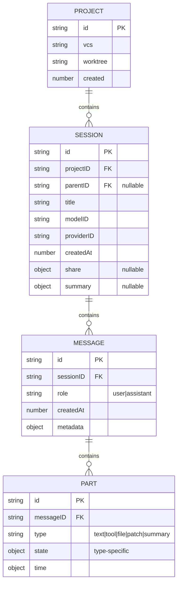
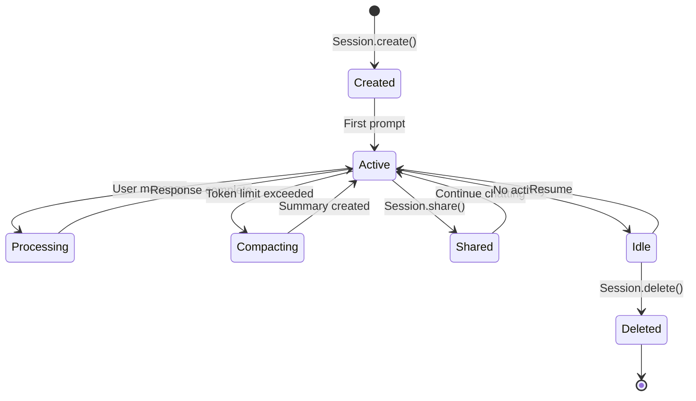
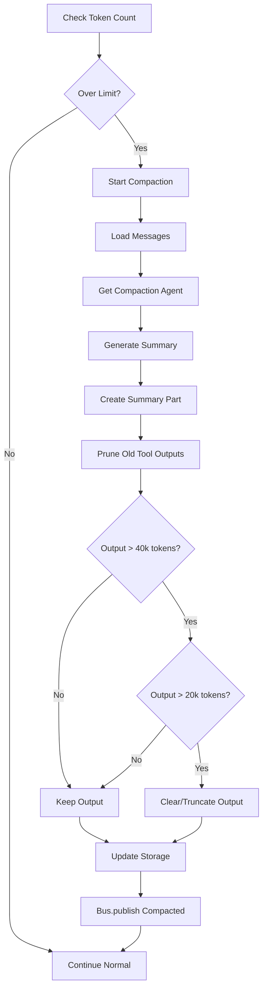

# Session Management

## What this component does

Session Management handles the lifecycle and state of conversation sessions. It provides:

- **Session CRUD**: Creating, reading, updating, deleting sessions
- **Message storage**: Persisting messages and their parts (text, tools, files)
- **Compaction**: Reducing context size when approaching token limits
- **Summarization**: Generating session and message summaries
- **Sharing**: Creating shareable session links
- **Usage tracking**: Token counts and cost calculation

## Key files

| File | Purpose |
|------|---------|
| `packages/opencode/src/session/index.ts` | Session namespace - CRUD, messages, usage |
| `packages/opencode/src/session/message-v2.ts` | MessageV2 structure and part management |
| `packages/opencode/src/session/compaction.ts` | Context compaction and pruning |
| `packages/opencode/src/session/summary.ts` | Session and message summarization |
| `packages/opencode/src/session/processor.ts` | Agentic loop (uses session for state) |
| `packages/opencode/src/session/prompt.ts` | Prompt assembly from session data |
| `packages/opencode/src/session/revert.ts` | Snapshot-based revert functionality |
| `packages/opencode/src/session/status.ts` | Session status (idle, processing) |

## Core data structures

### Session.Info
```typescript
interface Info {
  id: string                    // Unique session ID
  projectID: string             // Associated project
  parentID?: string             // Parent session (for sub-agents)
  version: 2                    // Schema version
  title?: string                // Session title
  share?: {
    url: string                 // Share URL
    time: number                // Share timestamp
  }
  createdAt: number             // Creation timestamp
  modelID: string               // Default model
  providerID: string            // Default provider
  summary?: {                   // Session summary stats
    additions: number
    deletions: number
  }
}
```

### MessageV2.Info
```typescript
interface Info {
  id: string
  sessionID: string
  role: "user" | "assistant"
  createdAt: number
  metadata: {
    time?: { start: number; end?: number }
    path?: { cwd: string; root: string }
    // Role-specific metadata
    user?: UserMetadata
    assistant?: AssistantMetadata
  }
}

interface AssistantMetadata {
  model: string
  provider: string
  summary?: string              // AI-generated summary
  error?: boolean
  restore?: { snapshotID: string }
}
```

### MessageV2.Part
```typescript
type Part =
  | { type: "text"; text: string; time?: TimeRange }
  | { type: "tool"; tool: string; state: ToolState }
  | { type: "file"; ... }
  | { type: "patch"; files: string[]; ... }
  | { type: "step-start" | "step-finish"; ... }
  | { type: "summary"; summary: string }

interface ToolState {
  id: string
  status: "pending" | "running" | "completed" | "error"
  input: Record<string, any>
  output?: string
  title?: string
  time: { start: number; end?: number; compacted?: number }
  metadata?: Record<string, any>
}
```

### Session.Usage
```typescript
interface Usage {
  input: number                 // Input tokens
  output: number                // Output tokens
  cache: { read: number; write: number }
  cost: {
    input: number               // Input cost USD
    output: number              // Output cost USD
    cache: { read: number; write: number }
    total: number
  }
}
```

## Control flow (step-by-step)

### 1. Session Creation
```
Session.create(options?)
  → Generate ID: Identifier.ascending("session")
  → Get default model from Config/Provider
  → Create Session.Info object
  → Storage.write(["session", projectID, sessionID], info)
  → Bus.publish(Session.Event.Created)
  → Return session info
```

### 2. Adding Messages
```
Session.addMessage({ sessionID, role, parts })
  → Generate message ID
  → Create MessageV2.Info with metadata
  → Storage.write(["message", sessionID, messageID], info)
  → For each part:
      → Generate part ID
      → Storage.write(["part", messageID, partID], part)
  → Bus.publish(MessageV2.Event.Created)
  → Return message ID
```

### 3. Part Updates (Streaming)
```
Session.updatePart(part)
  → Storage.write(["part", messageID, partID], part)
  → Bus.publish(MessageV2.Event.PartUpdated)

// Called frequently during streaming:
// - Text deltas appended
// - Tool status changes
// - Tool output added
```

### 4. Compaction (Context Overflow)
```
SessionCompaction.isOverflow({ tokens, model })
  → Calculate: input + cache.read + output
  → Compare against model.limit.input
  → Return true if exceeds limit

SessionCompaction.process({ sessionID, messages, ... })
  → Get "compaction" agent
  → Generate summary of conversation
  → Create summary message part
  → Prune old tool outputs
  → Bus.publish(Event.Compacted)
```

### 5. Pruning (Tool Output Cleanup)
```
SessionCompaction.prune({ sessionID })
  → Walk messages backward
  → Skip last 2 turns (recent context)
  → For tool parts with output:
      → If total > PRUNE_PROTECT (40k tokens):
          → Mark for pruning if > PRUNE_MINIMUM (20k)
          → Set part.state.time.compacted = now
          → Clear output (or truncate)
  → Update pruned parts in storage
```

### 6. Summarization
```
SessionSummary.summarize({ sessionID, messageID })
  → Parallel:
      → summarizeSession: Calculate diff stats
      → summarizeMessage: Generate AI summary
  → Update session/message metadata
  → Store summary in metadata.assistant.summary
```

### 7. Session Sharing
```
Session.share({ sessionID })
  → Collect session + messages + parts
  → POST to share service
  → Receive share URL
  → Update session.share = { url, time }
  → Return share URL
```

### Session Data Model (Mermaid)



### Session Lifecycle (Mermaid)



### Compaction Flow (Mermaid)



## Invariants / assumptions

1. **Append-only messages**: Messages never deleted mid-conversation (only compaction)

2. **Part immutability**: Once completed, parts are immutable (except compaction)

3. **Hierarchical storage**: Session → Messages → Parts in storage hierarchy

4. **Event-driven updates**: All mutations publish Bus events

5. **Token tracking**: Every assistant response tracks input/output/cache tokens

6. **Project scoping**: Sessions belong to a project (by projectID)

7. **Version migration**: Schema version in session enables future migrations

8. **Compaction preserves meaning**: Summary must capture essential context

## Open questions

1. **Compaction quality**: How is summary quality validated?

2. **Multi-model sessions**: Can model be changed mid-session?

3. **Message editing**: Can user messages be edited after sending?

4. **Branching**: Can sessions branch from a previous point?

5. **Export formats**: What formats are supported for session export?

6. **Retention policy**: How long are sessions retained?

## Change impact

| Change | Affected Areas |
|--------|----------------|
| Add part type | `message-v2.ts`, processor handling, UI rendering |
| Modify session schema | `index.ts`, storage migration, SDK types |
| Change compaction | `compaction.ts`, compaction agent prompt |
| Add metadata field | Relevant info type, storage, UI display |
| Modify storage layout | `index.ts`, storage migration |
| Add event type | Bus event definition, all subscribers |
| Change summary | `summary.ts`, summary agent, UI display |
