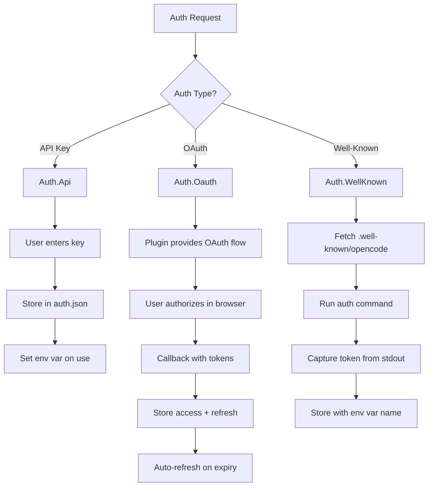
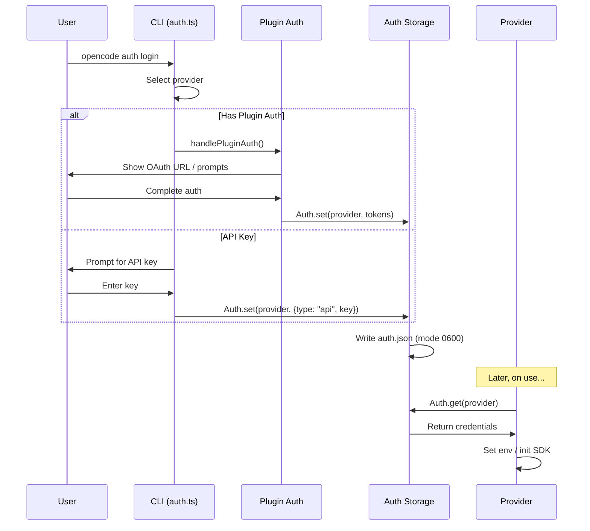

# Authentication

## What this component does

The Authentication system manages credentials for LLM providers and external services. It handles:

- **Credential storage**: Secure file-based storage for API keys and OAuth tokens
- **Multiple auth types**: API keys, OAuth 2.0 flows, and well-known discovery
- **Plugin auth hooks**: Extensible auth methods via plugins (e.g., Copilot, Claude Max)
- **CLI management**: Login, logout, and credential listing commands
- **Environment integration**: Fallback to environment variables for credentials

## Key files

| File | Purpose |
|------|---------|
| `packages/opencode/src/auth/index.ts` | Core Auth namespace - credential CRUD, schemas |
| `packages/opencode/src/provider/auth.ts` | ProviderAuth - OAuth flows, plugin integration |
| `packages/opencode/src/cli/cmd/auth.ts` | CLI commands: login, logout, list |
| `packages/opencode/src/provider/provider.ts` | Provider uses auth for SDK initialization |

## Core data structures

### Auth.Info (Discriminated Union)
```typescript
// API Key authentication
Auth.Api = {
  type: "api"
  key: string                   // The API key
}

// OAuth 2.0 authentication
Auth.Oauth = {
  type: "oauth"
  access: string                // Access token
  refresh: string               // Refresh token
  expires: number               // Expiry timestamp
  accountId?: string            // Optional account identifier
  enterpriseUrl?: string        // Enterprise endpoint override
}

// Well-known discovery authentication
Auth.WellKnown = {
  type: "wellknown"
  key: string                   // Environment variable name
  token: string                 // The token value
}

// Union type
Auth.Info = Auth.Api | Auth.Oauth | Auth.WellKnown
```

### Storage Location
```typescript
// Credentials stored in single JSON file
const filepath = path.join(Global.Path.data, "auth.json")

// File structure
{
  "anthropic": { "type": "api", "key": "sk-ant-..." },
  "github-copilot": { "type": "oauth", "access": "...", "refresh": "...", "expires": 1234567890 },
  "https://company.example": { "type": "wellknown", "key": "COMPANY_API_KEY", "token": "..." }
}

// File permissions: 0o600 (owner read/write only)
```

### ProviderAuth.Method
```typescript
interface Method {
  type: "oauth" | "api"         // Auth method type
  label: string                 // Display label for UI
}

interface Authorization {
  url: string                   // OAuth authorization URL
  method: "auto" | "code"       // Callback method
  instructions: string          // User instructions
}
```

## Control flow (step-by-step)

### 1. CLI Login Flow
```
opencode auth login
  → prompts.intro("Add credential")
  → prompts.autocomplete() for provider selection
  → Check for plugin auth:
      Plugin.list().find(x => x.auth?.provider === provider)
  → If plugin found: handlePluginAuth()
  → Else: prompts.password() for API key
  → Auth.set(provider, { type: "api", key })
```

### 2. Plugin OAuth Flow
```
handlePluginAuth(plugin, provider)
  → Select auth method if multiple
  → Collect prompts (text/select inputs)
  → If OAuth:
      → method.authorize(inputs) → { url, method, instructions }
      → If auto: spinner + await callback()
      → If code: prompt for code + callback(code)
      → On success: Auth.set(provider, { type: "oauth", ... })
  → If API:
      → method.authorize(inputs)
      → Auth.set(provider, { type: "api", key })
```

### 3. Well-Known Discovery Flow
```
opencode auth login https://company.example
  → fetch("https://company.example/.well-known/opencode")
  → Get auth.command from response
  → Bun.spawn(auth.command)
  → Capture stdout as token
  → Auth.set(url, { type: "wellknown", key: envVar, token })
```

### 4. Credential Retrieval (Provider Init)
```
Provider.provider(providerID)
  → Auth.get(providerID)
  → If found:
      → If api: set process.env[envVar] = key
      → If oauth: use access token, refresh if expired
      → If wellknown: set process.env[key] = token
  → Create SDK with credentials
```

### 5. Token Refresh (OAuth)
```
Provider needs fresh token:
  → Check Auth.Oauth.expires
  → If expired:
      → Use refresh token to get new access token
      → Auth.set(provider, { ...updated tokens })
  → Return valid access token
```

### Auth Types Comparison (Mermaid)



### Login Flow (Mermaid)



## Invariants / assumptions

1. **Single auth file**: All credentials stored in `~/.local/share/opencode/auth.json`

2. **File permissions**: Auth file written with mode 0o600 (owner-only access)

3. **Environment precedence**: Env vars checked before stored credentials

4. **Plugin-first**: Plugin auth methods take precedence over default API key flow

5. **Discriminated union**: Auth type determined by `type` field in stored object

6. **Zod validation**: All stored credentials validated on read via `Auth.Info.safeParse()`

7. **OAuth refresh**: Plugins responsible for implementing token refresh logic

8. **Well-known format**: Discovery URLs must serve `/.well-known/opencode` JSON

## Open questions

1. **Token encryption**: Are OAuth tokens encrypted at rest, or just file permissions?

2. **Refresh scheduling**: Is OAuth token refresh proactive or on-demand?

3. **Multi-account**: Can multiple accounts exist for the same provider?

4. **Credential migration**: How are credentials migrated across OpenCode versions?

5. **Revocation**: How are revoked OAuth tokens detected and handled?

6. **Keychain integration**: Is OS keychain (macOS Keychain, Windows Credential Manager) supported?

## Change impact

| Change | Affected Areas |
|--------|----------------|
| Add auth type | `auth/index.ts` schema, CLI handling, provider usage |
| Add provider auth | Plugin with `auth` hook, `provider/auth.ts` if built-in |
| Modify storage | `auth/index.ts`, migration needed, all credential reads |
| Add CLI subcommand | `cli/cmd/auth.ts`, command registration |
| Change OAuth flow | `provider/auth.ts`, plugin auth hooks |
| Add well-known field | `cli/cmd/auth.ts` login handler, discovery fetch |
