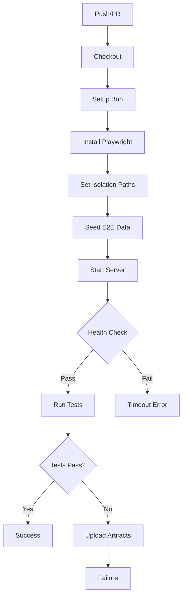
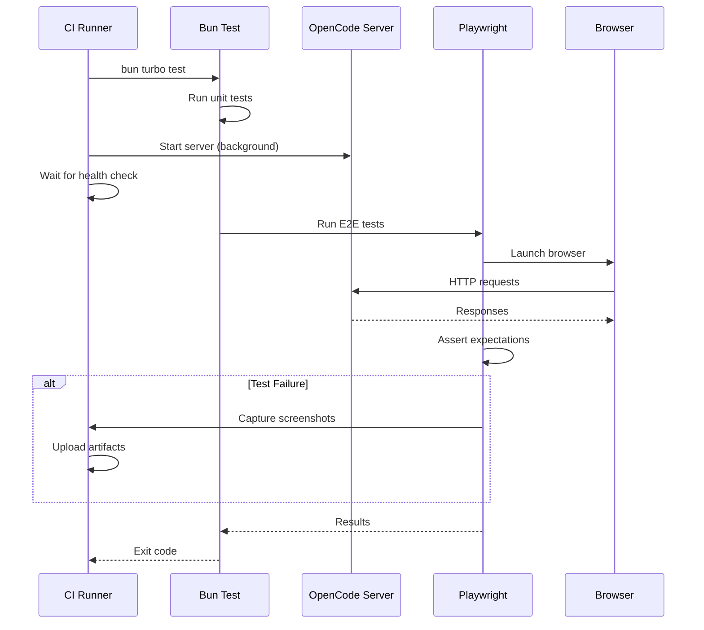

# Testing

## What this component does

The Testing infrastructure provides comprehensive test coverage for OpenCode through unit tests and end-to-end tests. It handles:

- **Unit testing**: Component-level tests using Bun's built-in test runner
- **E2E testing**: Full application tests using Playwright
- **CI integration**: Automated testing on pull requests and pushes
- **Cross-platform**: Tests run on Linux and Windows in CI
- **Test isolation**: Separate data directories prevent test interference

## Key files

| File | Purpose |
|------|---------|
| `.github/workflows/test.yml` | Main CI test workflow |
| `.github/workflows/typecheck.yml` | TypeScript type checking |
| `packages/opencode/test/` | Unit test directory |
| `packages/opencode/test/preload.ts` | Test setup and fixtures |
| `packages/app/e2e/` | Playwright E2E tests |
| `packages/app/e2e/fixtures.ts` | E2E test fixtures |
| `packages/app/e2e/actions.ts` | Reusable E2E actions |
| `packages/app/e2e/selectors.ts` | UI element selectors |
| `packages/opencode/script/seed-e2e.ts` | E2E data seeding script |

## Core data structures

### Test Directory Structure
```
packages/opencode/test/
├── preload.ts              # Global test setup
├── bun.test.ts             # Bun-specific tests
├── tool/                   # Tool tests
│   ├── bash.test.ts
│   ├── edit.test.ts
│   ├── grep.test.ts
│   ├── glob.test.ts
│   └── read.test.ts
├── session/                # Session tests
│   ├── compaction.test.ts
│   ├── processor.test.ts
│   └── prompt.test.ts
├── provider/               # Provider tests
│   └── transform.test.ts
├── permission/             # Permission tests
│   └── next.test.ts
├── config/                 # Config tests
│   └── config.test.ts
├── server/                 # API tests
│   └── routes.test.ts
├── mcp/                    # MCP tests
│   └── client.test.ts
└── fixture/                # Test fixtures
    └── projects/
```

### E2E Test Structure
```
packages/app/e2e/
├── fixtures.ts             # Playwright fixtures
├── actions.ts              # Reusable test actions
├── selectors.ts            # CSS/data-testid selectors
├── utils.ts                # Helper utilities
├── app/                    # App-level tests
│   ├── navigation.spec.ts
│   ├── theme.spec.ts
│   └── keyboard.spec.ts
├── prompt/                 # Prompt input tests
│   ├── submit.spec.ts
│   └── history.spec.ts
├── settings/               # Settings tests
│   ├── model.spec.ts
│   └── keybinds.spec.ts
├── sidebar/                # Sidebar tests
│   └── sessions.spec.ts
├── terminal/               # Terminal tests
│   └── pty.spec.ts
└── models/                 # Model-specific tests
```

### CI Environment Variables
```typescript
// Test isolation environment
{
  OPENCODE_E2E_ROOT: "$RUNNER_TEMP/opencode-e2e"
  OPENCODE_TEST_HOME: "$RUNNER_TEMP/opencode-e2e/home"
  XDG_DATA_HOME: "$RUNNER_TEMP/opencode-e2e/share"
  XDG_CACHE_HOME: "$RUNNER_TEMP/opencode-e2e/cache"
  XDG_CONFIG_HOME: "$RUNNER_TEMP/opencode-e2e/config"
  XDG_STATE_HOME: "$RUNNER_TEMP/opencode-e2e/state"

  // Feature flags for testing
  OPENCODE_DISABLE_SHARE: "true"
  OPENCODE_DISABLE_LSP_DOWNLOAD: "true"
  OPENCODE_DISABLE_DEFAULT_PLUGINS: "true"
  OPENCODE_EXPERIMENTAL_DISABLE_FILEWATCHER: "true"
}
```

## Control flow (step-by-step)

### 1. Unit Test Execution
```
bun test (in packages/opencode)
  → Load preload.ts (global setup)
  → Discover *.test.ts files
  → For each test file:
      → Import and execute tests
      → Report pass/fail
  → Generate coverage report
```

### 2. E2E Test Execution
```
bun test:e2e (in packages/app)
  → Playwright loads config
  → Start test server (or use running server)
  → For each spec file:
      → Create browser context
      → Load fixtures
      → Execute test steps
      → Capture screenshots on failure
  → Generate HTML report
```

### 3. CI Workflow (test.yml)
```
on: push/pull_request
  → Checkout repository
  → Setup Bun
  → Install Playwright browsers
  → Set OS-specific paths (isolation)
  → Seed E2E data (seed-e2e.ts)
  → Start opencode server (background)
  → Wait for server health check
  → Run tests (bun turbo test)
  → Upload artifacts on failure
```

### 4. Test Isolation Flow
```
CI sets environment variables:
  → XDG_* paths point to temp directory
  → OPENCODE_TEST_HOME overrides home
  → Each test run gets clean state
  → No interference between runs
```

### CI Pipeline (Mermaid)



### Test Execution Flow (Mermaid)



## Invariants / assumptions

1. **Bun test runner**: Unit tests use Bun's built-in test runner, not Jest/Vitest

2. **Playwright for E2E**: E2E tests use Playwright with Chromium

3. **Test isolation**: Each CI run uses isolated temp directories

4. **Server required**: E2E tests require running opencode server

5. **Health check**: Server must pass `/global/health` before E2E tests

6. **Fixtures pattern**: E2E uses Playwright fixtures for setup/teardown

7. **Data seeding**: E2E tests use pre-seeded session data

8. **Cross-platform**: Tests run on both Linux and Windows

## Running Tests Locally

### Unit Tests
```bash
# Run all unit tests
cd packages/opencode
bun test

# Run specific test file
bun test tool/bash.test.ts

# Run with coverage
bun test --coverage

# Watch mode
bun test --watch
```

### E2E Tests
```bash
# Start server first
cd packages/opencode
bun dev -- serve --port 4096

# In another terminal, run E2E tests
cd packages/app
bun test:e2e

# Run specific test
bun test:e2e prompt/submit.spec.ts

# Debug mode (headed browser)
bun test:e2e --headed

# Generate report
bun test:e2e --reporter=html
```

### Test Flags
```bash
# Skip features during testing
OPENCODE_DISABLE_SHARE=true
OPENCODE_DISABLE_LSP_DOWNLOAD=true
OPENCODE_DISABLE_DEFAULT_PLUGINS=true
```

## Open questions

1. **Coverage thresholds**: Are there minimum coverage requirements?

2. **Flaky tests**: How are flaky E2E tests handled/retried?

3. **Mock providers**: Are LLM providers mocked or use test accounts?

4. **Snapshot testing**: Is visual regression testing used?

5. **Performance tests**: Are there load/performance tests?

6. **Integration tests**: Are there tests against real LLM APIs?

## Change impact

| Change | Affected Areas |
|--------|----------------|
| Add unit test | `test/` directory, may need fixtures |
| Add E2E test | `e2e/` directory, may need selectors/actions |
| Modify CI | `.github/workflows/test.yml` |
| Add test fixture | `test/fixture/` or `e2e/fixtures.ts` |
| Change selectors | `e2e/selectors.ts`, all E2E tests using them |
| Add test env var | `test.yml` env section, local setup docs |
| Change test runner | `package.json` scripts, CI workflow |
