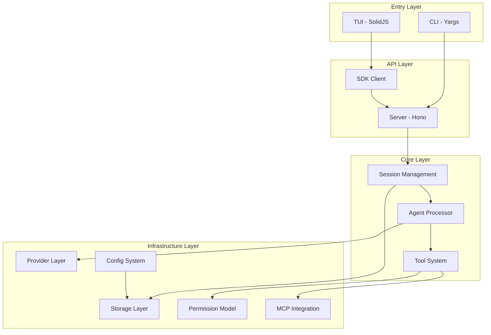
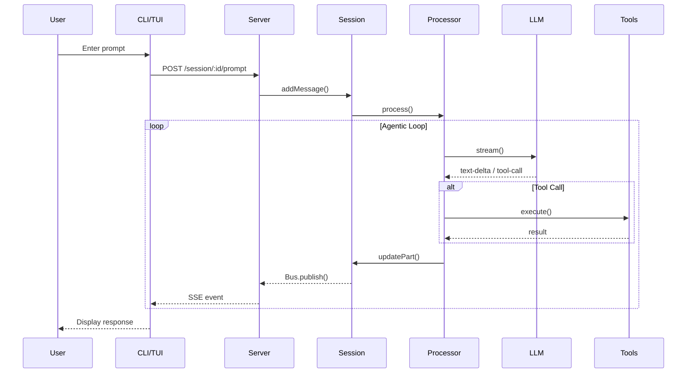
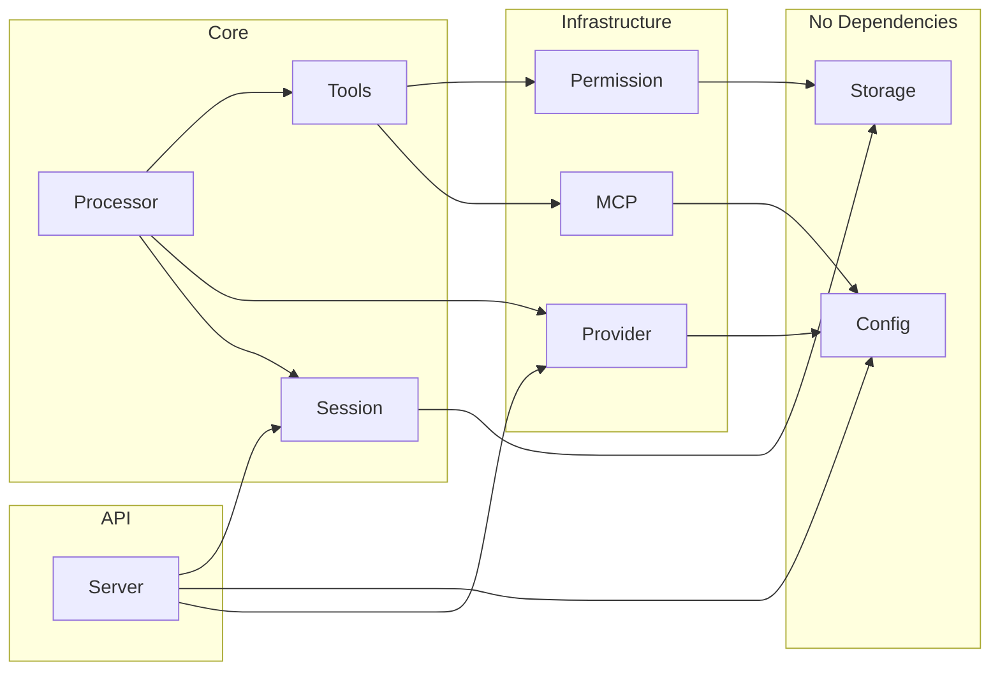

# OpenCode Architecture Documentation

This directory contains comprehensive architecture documentation for the OpenCode codebase.

## Quick Start

| If you want to... | Start here |
|-------------------|------------|
| Get an overview | [00-architecture-overview.md](./00-architecture-overview.md) |
| Understand the CLI | [01-cli-entrypoint.md](./01-cli-entrypoint.md) |
| Learn how the agent works | [02-agent-runtime.md](./02-agent-runtime.md) |
| Add a new LLM provider | [03-provider-layer.md](./03-provider-layer.md) |
| Create a custom tool | [04-tool-system.md](./04-tool-system.md) |
| Modify configuration | [05-config-system.md](./05-config-system.md) |
| Understand permissions | [06-permission-model.md](./06-permission-model.md) |
| Work with storage | [07-storage-layer.md](./07-storage-layer.md) |
| Add MCP integration | [08-mcp-integration.md](./08-mcp-integration.md) |
| Extend the API | [09-server-api.md](./09-server-api.md) |
| Modify the UI | [10-tui-app.md](./10-tui-app.md) |
| Understand sessions | [11-session-management.md](./11-session-management.md) |

## Document Structure

Each document follows a consistent schema:

```
# Topic
## What this component does     ← Purpose and responsibilities
## Key files                    ← File paths to read
## Core data structures         ← TypeScript types and interfaces
## Control flow (step-by-step)  ← How data moves through the system
## Invariants / assumptions     ← Things that must be true
## Open questions               ← Areas needing investigation
## Change impact                ← What breaks if you modify this
```

## Architecture Layers



## Request Lifecycle



## Component Dependencies



## Key Concepts

### Namespace Pattern
All modules use TypeScript namespaces for encapsulation:
```typescript
export namespace Session {
  export interface Info { ... }
  export function create() { ... }
  export function get() { ... }
}
```

### Instance State
Project-scoped lazy singletons via `Instance.state()`:
```typescript
const state = Instance.state(async () => {
  // Initialized once per project
  return { ... }
})
```

### Event Bus
Decoupled communication via pub/sub:
```typescript
Bus.publish(Session.Event.Created, { session })
// Subscribers receive events via SSE
```

### Layered Config
Configuration merges from multiple sources:
```
Managed (/etc) → Remote (.well-known) → Global (~/) → Project (./)
```

## Contributing

When modifying architecture:

1. **Update the relevant doc** - Keep documentation in sync with code
2. **Check "Change Impact"** - Understand downstream effects
3. **Address "Open Questions"** - Fill in gaps as you learn
4. **Add Mermaid diagrams** - Visualize complex flows
